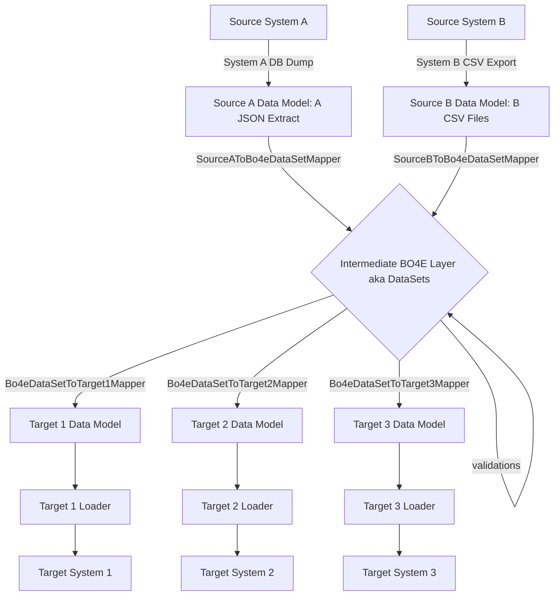
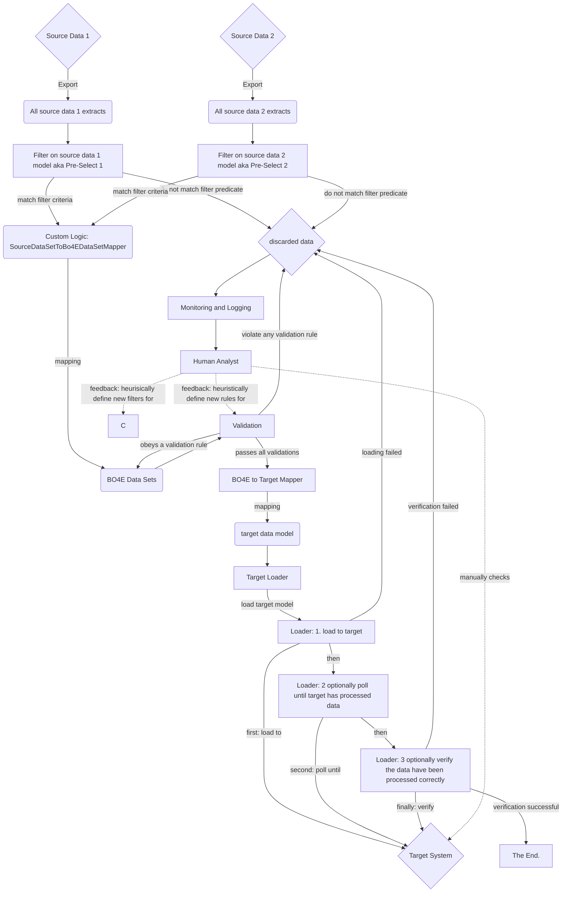

# BO4E Migration Framework (bomf)

BOMF is the BO4E Migration Framework.
This repository contains the code of the Python package [bomf](https://pypi.org/project/bomf).

## Rationale
bomf is a framework, that allows its users to migrate data
- from source systems (starting with the raw data extracts)
- into an intermediate, common BO4E based data layer.
- From there map data to individual target system data models
- and finally create records in target systems (aka "loading").

The framework
- encourages user to program consistent data processing pipelines from any source to any target system 
- enforces users to adapt to structured and consistent patterns
- and by doing so will lead to higher chances for maintainable and reusable code.

## Architeture / Overview
The overall setup for a migration from 1-n source systems (A, B, C...) to 1-m target systems (1,2, 3...) might look like this:

The Intermediate BO4E Layer (that consists of different so called DataSets) is kind of a contract between the code that maps *from the source data model* and the code that maps *to the target data model*.

### Data Migration Flow
The migration of specific data from source to target is always the same:

## How to use this Repository on Your Machine (Development)

Please follow the [instructions in our Python Template Repository](https://github.com/Hochfrequenz/python_template_repository).
tl;dr: `tox`.

## Contribute

You are very welcome to contribute to this template repository by opening a pull request against the main branch.
